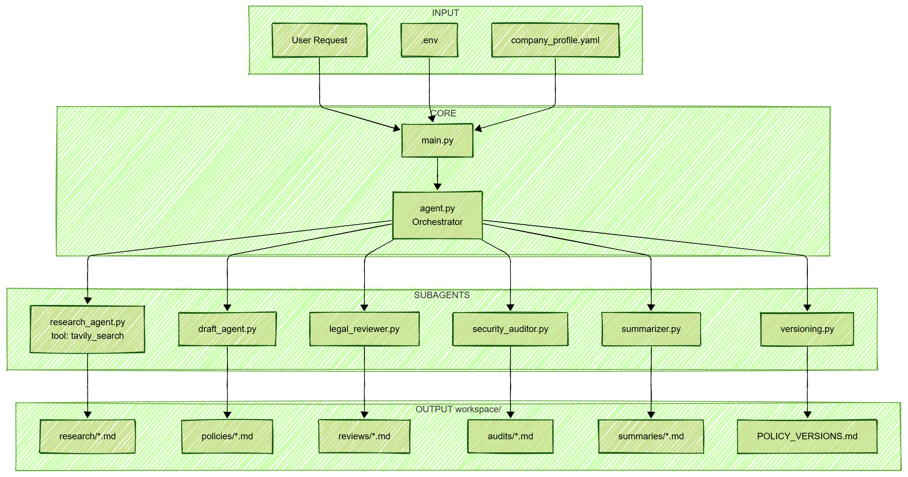

# 🛡️ Autonomous Compliance & Policy Generator

An AI-powered system that autonomously generates comprehensive compliance policies by researching real regulations and producing professional, company-specific documents.

Built on **[Deep Agents](https://docs.langchain.com/deepagents)** architecture using **LangChain** — leveraging planning, subagent orchestration, and filesystem tools for complex multi-step policy generation.

---

## 🏗️ Architecture

This project implements a **Deep Agent + Subagents** architecture:

- **Main Orchestrator Agent** — Coordinates the entire workflow, delegates tasks to specialized subagents
- **6 Specialized Subagents** — Each handles a specific phase of policy creation
- **Built-in Tools** — `write_todos`, `read_file`, `write_file`, `edit_file`, `ls`, `task`
- **Custom Tools** — `tavily_search` for real-time regulatory research

### Workflow Diagram



---

## ✨ Features

- **🔍 Real-time Regulatory Research** — Uses Tavily search to find current GDPR, HIPAA, SOC2, ISO27001 requirements
- **🏢 Company-Specific Policies** — Injects your company profile (name, contacts, systems, vendors) into all documents
- **📝 Comprehensive Output** — Generates policy documents, employee guides, legal reviews, security audits, and templates
- **🤖 Fully Autonomous** — One-shot execution with no user interaction required
- **📚 Version Tracking** — Maintains version history and changelogs

---

## 🧩 Subagents

| Subagent | File | Tool | Output |
|----------|------|------|--------|
| **Research Agent** | `research_agent.py` | `tavily_search` | `workspace/research/*.md` |
| **Draft Agent** | `draft_agent.py` | `read_file`, `write_file` | `workspace/policies/*.md` |
| **Legal Reviewer** | `legal_reviewer.py` | `read_file`, `write_file` | `workspace/reviews/*.md` |
| **Security Auditor** | `security_auditor.py` | `read_file`, `write_file` | `workspace/audits/*.md` |
| **Summarizer** | `summarizer.py` | `read_file`, `write_file` | `workspace/summaries/*.md` |
| **Versioning** | `versioning.py` | `read_file`, `write_file` | `POLICY_VERSIONS.md` |

---

## 📁 Project Structure

```
policy_generator/
├── main.py                    # Entry point
├── company_profile.yaml       # Your company configuration
├── .env                       # API keys (OPENAI, TAVILY)
├── requirements.txt           # Dependencies
│
├── deepagent/
│   ├── agent.py               # Main orchestrator agent
│   └── subagents/
│       ├── research_agent.py  # Regulatory research (Tavily)
│       ├── draft_agent.py     # Policy drafting
│       ├── legal_reviewer.py  # Legal compliance review
│       ├── security_auditor.py# Security audit
│       ├── summarizer.py      # Employee guide creation
│       └── versioning.py      # Version management
│
├── utils/
│   ├── config.py              # LLM configuration
│   └── company_config.py      # Company profile loader
│
├── workspace/                 # Generated output (auto-created)
│   ├── policies/              # Final policies & templates
│   ├── summaries/             # Employee guides
│   ├── research/              # Regulatory research
│   ├── reviews/               # Legal reviews
│   ├── audits/                # Security audits
│   └── POLICY_VERSIONS.md     # Master version log
│
└── assets/
    └── workflow.png           # Architecture diagram
```

---

## 🚀 Quick Start

### 1. Clone & Setup

```bash
cd policy_generator
python -m venv venv
source venv/bin/activate  # On Windows: venv\Scripts\activate
pip install -r requirements.txt
```

### 2. Configure Environment

Copy the example and add your API keys:

```bash
cp .env.example .env
```

Edit `.env` with your keys:

```env
# OpenAI API Key (required)
# Get yours at: https://platform.openai.com/api-keys
OPENAI_API_KEY=sk-xxxxxxxxxxxxxxxxxxxxxxxxxxxxxxxxxxxxxxxx

# Tavily API Key (required for web search in research agent)
# Get yours at: https://tavily.com (free tier available)
TAVILY_API_KEY=tvly-xxxxxxxxxxxxxxxxxxxxxxxxxxxxxxxx

# LangSmith API Key (optional - for tracing/debugging)
# Get yours at: https://smith.langchain.com
LANGCHAIN_API_KEY=lsv2_xxxxxxxxxxxxxxxxxxxxxxxxxxxxxxxx
LANGCHAIN_TRACING_V2=true
LANGCHAIN_PROJECT=compliance-policy-generator
```

### 3. Customize Company Profile

Edit `company_profile.yaml` with your company details:

```yaml
company:
  name: "Your Company Inc."
  legal_entity: "Your Company Inc., a Delaware Corporation"
  industry: "Healthcare"

contacts:
  dpo:
    name: "Jane Doe"
    email: "dpo@yourcompany.com"
  ciso:
    name: "John Smith"
    email: "ciso@yourcompany.com"

# ... more configuration
```

### 4. Run

```bash
python main.py
```

---

## 📦 Output Deliverables

After running, you'll find these files in `workspace/`:

| Deliverable | Location |
|-------------|----------|
| **Final Policy Document** | `policies/final_policy_*.md` |
| **Employee Guide** | `summaries/employee_guide_*.md` |
| **BAA Template** (HIPAA) | `policies/template_baa_*.md` |
| **DPA Template** (GDPR) | `policies/template_dpa_*.md` |
| **TIA Template** | `policies/template_tia_*.md` |
| **Retention Schedule** | `policies/retention_schedule_*.md` |
| **Legal Review** | `reviews/legal_review_*.md` |
| **Security Audit** | `audits/security_audit_*.md` |
| **Research Files** | `research/*.md` |
| **Version Log** | `POLICY_VERSIONS.md` |

---

## 🔧 Configuration

### LLM Model

Edit `utils/config.py` to change the model:

```python
LLM = ChatOpenAI(
    model="gpt-4o-mini",  # Change model here
    temperature=0,
)
```

### Company Profile

Edit `company_profile.yaml` to customize:
- Company name and legal entity
- Industry and regulatory applicability
- Employee count and locations
- Systems and vendors
- Contact information (DPO, CISO, Legal)

---

## 🛠️ Tech Stack

- **[Deep Agents](https://docs.langchain.com/deepagents)** — Multi-step task orchestration with planning and subagents
- **[LangChain](https://langchain.com)** — LLM framework
- **[Tavily](https://tavily.com)** — Real-time web search for regulatory research
- **[OpenAI GPT](https://openai.com)** — Language model

---

## 📄 License

MIT License

---

## 🤝 Contributing

Contributions welcome! Please open an issue or PR.

---

Built with ❤️ using Deep Agents + LangChain

